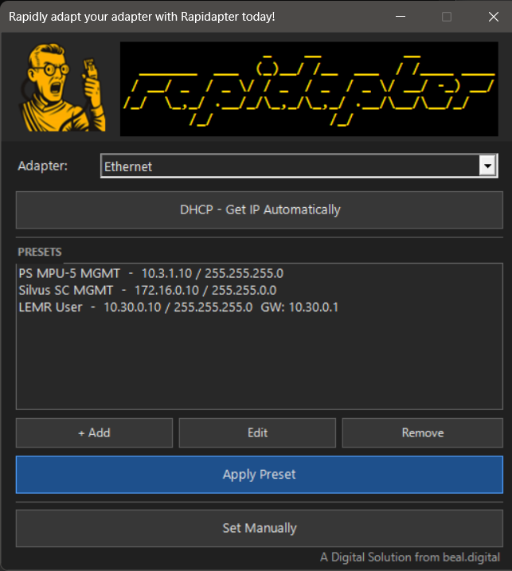

# Rapidapter - the rapid adapter adapter.



Rapidapter is a lightweight Windows utility for rapidly switching IPv4 network adapter configurations via a unified GUI. Built for those who frequently reconfigure network adapters for different devices and networks.

Instead of digging through Settings > Network > Adapter Properties every time, save your common configurations as named presets and apply them in two clicks.

## Download

**[Get the latest installer from the Releases page](../../releases/latest)**

Download `Rapidapter-Setup-x.x.x.exe`, run it, and you're done.

## Features

- Named presets saved to a local JSON file -- add, edit, and remove at any time
- Optional gateway and DNS per preset
- One-click DHCP toggle
- Manual IP entry for one-off configurations
- Self-elevating -- no need to right-click "Run as Administrator"
- Dark-mode UI

## Usage

Select your network adapter from the dropdown, pick a preset from the list, and click **Apply Preset**. The change takes effect immediately.

To add a preset, click **+ Add** and fill in a name, IP address, and subnet mask. Gateway and DNS are optional.

## Running without the installer

If you are on a locked-down network where running an installer is not possible, you can run the PowerShell script directly:

```powershell
.\Rapidapter.ps1
```

PowerShell 5.1 or later is required (built into Windows 10 and 11). The script will prompt for elevation via UAC automatically.

Presets are saved to `presets.json` in the same directory as the script.

## Building from source

Prerequisites:
```powershell
Install-Module ps2exe -Scope CurrentUser
# Optional - required to produce the Setup .exe:
winget install JRSoftware.InnoSetup
```

Build:
```powershell
.\Build-Rapidapter.ps1 -Version "1.0.0"
```

Output goes to `dist\` (compiled exe + assets) and `installer\Output\` (setup exe).

## Uninstalling

If you installed via the setup exe, use **Windows Settings > Apps > Installed Apps** and search for Rapidapter.

If you used the PowerShell installer (`Install-Rapidapter.ps1`), run:
```powershell
.\Uninstall-Rapidapter.ps1
```

---

*A Digital Solution from [beal.digital](https://beal.digital)*